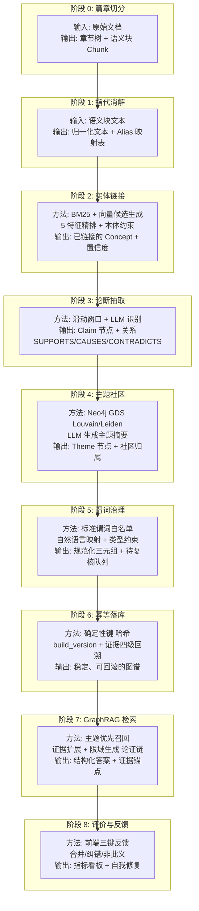
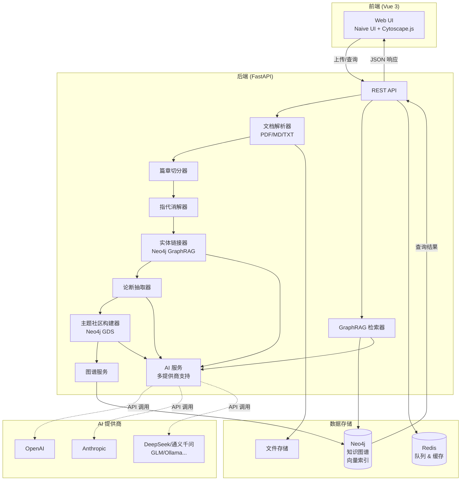

# LunarInsight | 月悟

> **A quiet knowledge graph engine for insight.**  
> 在静夜中沉淀知识、联结万象、点亮顿悟。

[](LICENSE)
[](https://www.python.org)
[](https://vuejs.org)
[](https://neo4j.com)

**语言**: [English](README_EN.md) | [简体中文](README.md)

---

## 🖼️ 项目截图

<details>
<summary>点击查看截图</summary>

### 仪表盘
> 知识图谱统计概览和最近活动
<!--  -->

### 知识图谱可视化
> 使用 Cytoscape.js 进行交互式图谱探索
<!--  -->

### 知识卡片管理
> 创建和管理带有丰富元数据的知识卡片
<!--  -->

### 文档上传与处理
> 上传文档，让 AI 自动提取知识
<!--  -->

</details>

---

## 📖 目录

- [项目简介](#1-项目简介)
- [核心特性](#2-核心特性)
- [知识图谱处理算法](#知识图谱处理算法)
- [系统架构](#3-系统架构)
- [核心模块](#4-核心模块)
- [技术栈](#5-技术栈)
- [快速开始](#6-快速开始)
- [API 概览](#7-api-概览)
- [数据模型](#8-数据模型)
- [使用示例](#9-使用示例)
- [路线图](#10-路线图)
- [文档资源](#-文档资源)
- [贡献指南](#-贡献指南)
- [故障排查](#-故障排查)
- [开源协议](#-开源协议)

---

## 1) 项目简介

**LunarInsight（月悟）** 是一个 AI 驱动的开源个人知识图谱系统，将你的文档转化为互联的知识网络。采用 Neo4j GraphRAG 技术，实现从"三元组堆叠"到"全文理解型知识图谱"的升级，提供强大的知识探索与分析能力。

- **🤖 AI 驱动**：支持 12 种 AI 提供商（OpenAI、Anthropic、DeepSeek、通义千问、Ollama 等）
- **📚 文档处理**：上传 PDF、Markdown 或纯文本文件，自动提取知识
- **🕸️ 知识图谱**：构建和可视化概念间的语义关系
- **🧠 GraphRAG**：基于 Neo4j GraphRAG 的智能检索与问答（v2.0）
- **📖 篇章理解**：从句子级三元组升级到篇章结构 + 论断 + 主题社区
- **💡 智能卡片**：手动创建或通过 AI 提取管理知识卡片
- **🔍 查询探索**：使用 Cytoscape.js 进行交互式图谱可视化
- **🌐 双语支持**：完整的中英文界面

## 2) 核心特性

- **🎯 AI 智能分析**
  - 深度语义理解，支持自定义提示词
  - 丰富的概念提取，包含类别、领域、重要性级别
  - 语义关系识别（因果、包含、比较等）
  - 知识洞察与理解生成
  - 自动提示词优化以获得更好结果

- **🧠 GraphRAG 智能检索（v2.0）**
  - 8 阶段知识图谱构建流程（篇章切分、指代消解、实体链接、论断抽取、主题社区、谓词治理、幂等落库、GraphRAG 检索）
  - 主题优先召回 + 向量混合检索 + 图遍历
  - 论证链生成：支持论断间的 SUPPORTS/CAUSES/CONTRADICTS 关系
  - 四级证据回溯：doc → chunk → section → sentence
  - 谓词治理：标准谓词白名单 + 本体约束 + 反馈闭环
  - 基于 Neo4j GDS 的主题社区检测与摘要生成

- **🗂️ 灵活的知识管理**
  - 手动创建或 AI 提取知识卡片
  - 标签系统，支持别名和关联概念
  - 领域和类别组织
  - 重要性级别（低、中、高）
  - 通过 REST API 完整的增删改查操作

- **🔌 多提供商 AI 支持**
  - 12 种 AI 提供商：OpenAI、Anthropic、Google Gemini、DeepSeek、通义千问、智谱 GLM、Kimi、文心一言、MiniMax、豆包、Ollama、Mock
  - 统一配置接口
  - 轻松切换提供商
  - 通过 Ollama 支持本地模型

- **🎨 现代化 UI**
  - Vue 3 + Vite + Naive UI
  - 使用 Cytoscape.js 的交互式图谱可视化
  - 实时处理状态
  - 响应式设计
  - 暗黑模式（即将推出）

- **🔐 隐私与安全**
  - 本地优先架构
  - 自托管部署
  - 数据不离开你的基础设施
  - 可选的身份认证（JWT + RBAC 计划中）

---

## 知识图谱处理算法

LunarInsight 采用 **8 阶段知识图谱构建流程**，实现从"三元组堆叠"到"全文理解型知识图谱"的升级。该算法基于 Neo4j GraphRAG 技术，能够从文档中提取篇章结构、论断、主题社区等深层语义信息。

### 核心理念：从"摘点"到"读篇章"

| 维度         | 传统方法           | LunarInsight v2.0                          |
| ------------ | ------------------ | ------------------------------------------- |
| **构建粒度** | 句子级三元组       | 篇章结构 + 论断 + 主题社区                  |
| **检索方式** | 关键词匹配         | 主题优先 + 向量混合 + 图遍历                 |
| **回答质量** | 段落拼接           | 论证链 + 证据引用 + 全局视角                 |
| **可维护性** | 谓词自由生长       | 本体约束 + 治理反馈闭环                      |
| **可解释性** | 无证据回溯         | 四级回溯（doc → chunk → section → sentence） |

### 8 阶段构建流程



### 阶段详解

#### 阶段 0: 篇章切分 (Semantic Chunker)

**目标**: 将文档切分为语义连贯的块（Chunk），保留章节结构和元数据。

**核心方法**:
- 提取章节树（标题层级识别）
- 句子级切分（spaCy/NLTK）
- 滑动窗口（3-5 句，步长 2）
- 保留元数据：`section_path`、`page_num`、`sentence_ids`

**输出**: `Chunk` 节点，包含文本、章节路径、句子索引、向量嵌入。

#### 阶段 1: 指代消解 (Coreference Resolution)

**目标**: 归一化文本，解决代词和简称问题，生成别名映射表。

**核心方法**:
- 提取括号别名（"人工智能（AI）" → `{AI: 人工智能}`）
- 轻量指代消解（"它" → 最近先行词）
- 生成 `Alias` 映射表，供实体链接使用

**输出**: 归一化文本 + `Alias` 映射表。

#### 阶段 2: 实体链接 (Entity Linker)

**目标**: 将文本中的实体提及链接到知识图谱中的 `Concept` 节点。

**核心方法**（基于 Neo4j GraphRAG）:
1. **候选生成**: BM25 + 向量相似度搜索
2. **精排**: 5 特征融合（文本相似度、向量相似度、上下文匹配、共现频率、置信度）
3. **本体约束**: 检查节点类型和关系类型是否符合本体定义
4. **阈值控制**: 
   - 置信度 ≥ 0.85：直接链接
   - 0.65 ≤ 置信度 < 0.85：人工复核
   - 置信度 < 0.65：创建新 `Concept`

**输出**: 已链接的 `Concept` 节点 + 置信度分数。

#### 阶段 3: 论断抽取 (Claim Extractor)

**目标**: 从语义块中提取论断（Claim），识别论断间的逻辑关系。

**核心方法**:
- 滑动窗口扫描（跨句分析）
- LLM 识别论断类型：`fact`（事实）、`hypothesis`（假设）、`conclusion`（结论）
- 提取论断关系：
  - `SUPPORTS`: 支持关系
  - `CONTRADICTS`: 矛盾关系
  - `CAUSES`: 因果关系
  - `COMPARES_WITH`: 比较关系

**输出**: `Claim` 节点 + 论断关系边。

#### 阶段 4: 主题社区构建 (Theme Builder)

**目标**: 使用图算法检测主题社区，生成主题摘要。

**核心方法**（基于 Neo4j GDS）:
1. **社区检测**: Louvain/Leiden 算法，基于概念共现图
2. **主题生成**: LLM 为每个社区生成主题标签和摘要
3. **层级构建**: 支持多级主题（粗粒度/细粒度）

**输出**: `Theme` 节点 + `BELONGS_TO_THEME` 关系。

#### 阶段 5: 谓词治理 (Predicate Governor)

**目标**: 规范化关系类型，防止谓词爆炸。

**核心方法**:
- **标准谓词白名单**: 预定义允许的关系类型（如 `USES`、`IS_A`、`PART_OF`、`CREATES`）
- **自然语言映射**: 将 LLM 输出的自然语言关系映射到标准谓词
- **类型约束**: 检查关系两端节点类型是否符合本体定义
- **反馈闭环**: 用户反馈更新映射表

**输出**: 规范化三元组 + 待复核队列。

#### 阶段 6: 幂等落库 (Graph Service)

**目标**: 确保构建过程的幂等性和可回滚性。

**核心方法**:
- **确定性键**: 使用哈希值（文档内容 + 配置）作为唯一标识
- **版本控制**: `build_version` 字段记录每次构建版本
- **证据四级回溯**: 每个节点/关系都记录证据路径
  - `doc_id` → `chunk_id` → `section_path` → `sentence_ids`
- **增量更新**: 支持增量构建，只更新变更部分

**输出**: 稳定、可回滚的知识图谱。

#### 阶段 7: GraphRAG 检索 (Query Service)

**目标**: 基于知识图谱进行智能检索和问答。

**核心方法**:
1. **主题优先召回**: 根据查询主题匹配 `Theme`，召回相关 `Claim` 和 `Concept`
2. **向量混合检索**: 结合向量相似度搜索和关键词匹配
3. **证据扩展**: 沿着 `SUPPORTS`/`CAUSES` 关系扩展论证链
4. **限域生成**: 在召回的证据范围内生成答案，包含证据锚点

**输出**: 结构化答案 + 证据锚点（四级回溯路径）。

#### 阶段 8: 评价与反馈 (Metrics + Feedback Loop)

**目标**: 收集用户反馈，持续优化知识图谱质量。

**核心方法**:
- **前端三键反馈**: 
  - ✅ **合并**: 两个概念应合并为一个
  - ❌ **纠错**: 关系或属性错误
  - ⚠️ **非此义**: 实体链接错误
- **自动修复**: 根据反馈更新 `Alias` 映射表和谓词映射
- **指标看板**: 展示构建质量指标（链接准确率、论断置信度等）

**输出**: 指标看板 + 自我修复的知识图谱。

### 技术亮点

1. **Neo4j GraphRAG 集成**: 直接使用官方 `KnowledgeGraphBuilder`、`Neo4jVectorStore`、`CommunityDetector` 等组件
2. **向量索引支持**: 利用 Neo4j 5.15+ 的向量索引，实现高效语义检索
3. **图算法增强**: 使用 Neo4j GDS 进行社区检测和图分析
4. **四级证据回溯**: 每个知识片段都可以追溯到原始文档的具体位置
5. **论证链生成**: 支持论断间的逻辑关系，生成完整的论证链
6. **本体约束**: 通过谓词白名单和类型约束，确保知识图谱的可维护性

### 数据模型

**新增节点类型**:
- `Chunk`: 语义块（包含文本、章节路径、句子索引、向量嵌入）
- `Claim`: 论断（包含文本、类型、置信度、证据位置）
- `Theme`: 主题社区（包含标签、摘要、关键词、社区 ID）

**新增关系类型**:
- `CONTAINS`: 文档包含块
- `CONTAINS_CLAIM`: 块包含论断
- `SUPPORTS`/`CONTRADICTS`/`CAUSES`/`COMPARES_WITH`: 论断关系
- `BELONGS_TO_THEME`: 概念/论断归属主题
- `EVIDENCE_FROM`: 证据回溯关系

详细的数据模型定义请参考 [数据模型](#8-数据模型) 章节。

---

## 3) 系统架构



## 4) 核心模块

**前端（Vue 3）**
- **🏠 仪表盘**：知识图谱统计概览和最近活动
- **📤 知识构建**：文档上传和 AI 驱动处理
- **🃏 知识卡片**：手动创建和管理知识卡片
- **🕸️ 图谱可视化**：使用 Cytoscape.js 进行交互式图谱探索
- **🔍 查询**：高级图谱查询的 Cypher 查询界面
- **⚙️ 设置**：系统配置和 AI 提供商设置
- **📊 状态**：实时处理状态和系统健康

**后端（FastAPI）**
- **文档处理**：多格式解析器（PDF、Markdown、TXT）
- **AI 集成**：12+ AI 提供商的统一接口
- **知识提取**：智能概念和关系提取
- **GraphRAG 构建**：8 阶段知识图谱构建流程
  - 篇章切分（Chunker）：章节树 + 语义块
  - 指代消解（Coref）：归一化文本 + Alias 映射
  - 实体链接（Entity Linker）：Neo4j GraphRAG 集成
  - 论断抽取（Claim Extractor）：论证链构建
  - 主题社区（Theme Builder）：Neo4j GDS 社区检测
  - 谓词治理（Predicate Governor）：本体约束
  - 幂等落库（Graph Service）：证据回溯
  - GraphRAG 检索（Query Service）：智能问答
- **图谱管理**：Neo4j 增删改查操作和查询执行
- **队列管理**：使用 Redis 的异步处理
- **API 路由**：所有操作的 RESTful 端点

## 5) 技术栈

| 层级 | 技术 |
|------|------|
| **前端** | Vue 3, TypeScript, Vite, Naive UI, Cytoscape.js, Axios, Vue-i18n, Pinia |
| **后端** | Python 3.11+, FastAPI, Pydantic v2, Uvicorn |
| **数据库** | Neo4j 5.15+ (Bolt), Redis 7.x |
| **GraphRAG** | neo4j-graphrag, graphdatascience (GDS), sentence-transformers |
| **AI/ML** | OpenAI, Anthropic, Google Gemini, DeepSeek, 阿里云通义千问, 智谱GLM, 月之暗面Kimi, 百度文心一言, MiniMax, 字节豆包, Ollama |
| **文档处理** | PyMuPDF (PDF), Markdown, 纯文本, spaCy/NLTK (句子切分) |
| **向量搜索** | Neo4j 向量索引 (text-embedding-3-small, 1536维) |
| **容器化** | Docker, Docker Compose |
| **未来计划** | OpenTelemetry, Prometheus |

## 6) 快速开始

**先决条件**
- Docker & Docker Compose（推荐）
- 或 Python 3.11+、Node.js 18+、Neo4j 5.15+（支持向量索引）、Redis 7.x（用于本地开发）

**方式 A：Docker Compose（推荐）**

```bash
# 1. 克隆仓库
git clone https://github.com/yourusername/LunarInsight.git
cd LunarInsight

# 2. 配置环境变量
cat > .env << EOF
# AI 提供商配置（选择一个）
AI_PROVIDER=openai
AI_API_KEY=sk-your-api-key-here

# 或使用 Ollama 本地模型
# AI_PROVIDER=ollama
# AI_BASE_URL=http://host.docker.internal:11434

# Neo4j 配置
NEO4J_URI=bolt://neo4j:7687
NEO4J_USER=neo4j
NEO4J_PASS=test1234

# Redis 配置
REDIS_URL=redis://redis:6379/0

# GraphRAG 配置（v2.0）
ENABLE_NEO4J_GRAPHRAG=true
ENABLE_VECTOR_SEARCH=true
LLM_MODEL=gpt-4o-mini
EMBEDDING_MODEL=text-embedding-3-small
EOF

# 3. 启动所有服务
docker-compose up -d

# 4. 访问应用
# - 前端：http://localhost:8788
# - API 文档：http://localhost:8000/docs
# - Neo4j 浏览器：http://localhost:7474 (neo4j/test1234)
```

**方式 B：本地开发**

```bash
# 1. 使用 Docker 启动 Neo4j 和 Redis
docker-compose up -d neo4j redis

# 2. 设置后端
cd server
python -m venv venv
source venv/bin/activate  # Windows: venv\Scripts\activate
pip install -r requirements.txt

# 配置环境变量
export NEO4J_URI=bolt://localhost:7687
export NEO4J_USER=neo4j
export NEO4J_PASS=test1234
export AI_PROVIDER=openai
export AI_API_KEY=sk-your-key

# 启动后端
uvicorn main:app --reload --port 8000

# 3. 设置前端（在另一个终端）
cd app/vue
npm install
npm run dev  # 在 http://localhost:5173 启动
```

**📖 详细指南**
- [AI 提供商配置](docs/AI_PROVIDERS.md) - 所有 12 个 AI 提供商的设置
- [快速开始指南](QUICKSTART.md) - 全面的设置说明
- [环境变量](docs/env-template.md) - 完整配置参考

## 7) API 概览

**文档与知识管理**
```
POST   /uploads/file               # 上传文件 (PDF/MD/TXT)
POST   /uploads/text               # 上传文本内容
GET    /uploads/{file_id}          # 获取文件信息
POST   /ingest/{document_id}       # 启动 AI 提取
GET    /ingest/status/{job_id}     # 查看处理状态
```

**知识卡片**
```
POST   /knowledge-cards            # 创建知识卡片
GET    /knowledge-cards            # 列出卡片（支持过滤）
GET    /knowledge-cards/{card_id}  # 获取卡片详情
PUT    /knowledge-cards/{card_id}  # 更新卡片
DELETE /knowledge-cards/{card_id}  # 删除卡片
```

**图谱操作**
```
GET    /graph/query                # 执行 Cypher 查询
GET    /graph/nodes                # 获取所有节点
GET    /graph/edges                # 获取所有关系
GET    /graph/stats                # 获取图谱统计
```

**GraphRAG 查询（v2.0）**
```
POST   /graphrag/query             # GraphRAG 智能问答
POST   /graphrag/feedback/merge    # 合并概念反馈
POST   /graphrag/feedback/correct  # 纠错关系反馈
POST   /graphrag/feedback/unlink   # 取消链接反馈
```

**系统**
```
GET    /settings/ai-providers      # 列出可用的 AI 提供商
GET    /settings/config            # 获取系统配置
PUT    /settings/config            # 更新配置
GET    /                           # API 健康检查
GET    /docs                       # OpenAPI 文档
```

📚 **完整 API 文档**：运行时访问 `http://localhost:8000/docs`

## 8) 数据模型

**节点类型**
- **`Concept`**：核心知识实体
  - 属性：`name`, `description`, `domain`, `category`, `importance`, `tags`, `created_at`, `updated_at`, `source`, `embedding` (向量)
- **`Document`**：上传的文档
  - 属性：`id`, `filename`, `checksum`, `kind`, `size`, `created_at`, `status`
- **`Chunk`**：语义块（v2.0）
  - 属性：`id`, `text`, `doc_id`, `section_path`, `page_num`, `sentence_ids`, `embedding` (向量)
- **`Claim`**：论断（v2.0）
  - 属性：`id`, `text`, `doc_id`, `chunk_id`, `sentence_ids`, `confidence`, `claim_type` (fact/hypothesis/conclusion)
- **`Theme`**：主题社区（v2.0）
  - 属性：`id`, `label`, `summary`, `level`, `keywords`, `community_id`, `member_count`
- **`Alias`**：概念的别名
  - 属性：`surface_form`, `canonical`, `doc_id`, `confidence`

**关系类型**
- **`MENTIONS`**：文档提及概念
  - 属性：`evidence`, `offset`, `confidence`
- **`CONTAINS`**：文档包含语义块（v2.0）
  - 无属性
- **`CONTAINS_CLAIM`**：语义块包含论断（v2.0）
  - 无属性
- **`SUPPORTS`** / **`CONTRADICTS`** / **`CAUSES`** / **`COMPARES_WITH`**：论断间关系（v2.0）
  - 无属性
- **`BELONGS_TO_THEME`**：概念/论断归属主题（v2.0）
  - 无属性
- **`EVIDENCE_FROM`**：概念/论断的证据来源（v2.0）
  - 属性：`doc_id`, `section_path`, `sentence_ids`
- **`DERIVES_FROM`**：概念派生自另一概念
  - 属性：`relationship_type`, `description`
- **`RELATED_TO`**：概念相关
  - 属性：`strength`, `context`
- **`REFERS_TO`**：别名指向概念
  - 无属性

**Neo4j 约束与索引**
```cypher
# 约束
CREATE CONSTRAINT concept_name_unique IF NOT EXISTS
  FOR (c:Concept) REQUIRE c.name IS UNIQUE;

CREATE CONSTRAINT document_id_unique IF NOT EXISTS
  FOR (d:Document) REQUIRE d.id IS UNIQUE;

CREATE CONSTRAINT chunk_id_unique IF NOT EXISTS
  FOR (c:Chunk) REQUIRE c.id IS UNIQUE;

CREATE CONSTRAINT claim_id_unique IF NOT EXISTS
  FOR (cl:Claim) REQUIRE cl.id IS UNIQUE;

CREATE CONSTRAINT theme_id_unique IF NOT EXISTS
  FOR (t:Theme) REQUIRE t.id IS UNIQUE;

# 索引
CREATE INDEX document_checksum IF NOT EXISTS
  FOR (d:Document) ON (d.checksum);

CREATE INDEX concept_domain IF NOT EXISTS
  FOR (c:Concept) ON (c.domain);

CREATE INDEX concept_category IF NOT EXISTS
  FOR (c:Concept) ON (c.category);

CREATE INDEX alias_canonical IF NOT EXISTS
  FOR (a:Alias) ON (a.canonical);

# 向量索引（Neo4j 5.11+）
CALL db.index.vector.createNodeIndex(
  'concept_embeddings',
  'Concept',
  'embedding',
  1536,
  'cosine'
);

CALL db.index.vector.createNodeIndex(
  'chunk_embeddings',
  'Chunk',
  'embedding',
  1536,
  'cosine'
);
```

## 9) 使用示例

**1. 上传并处理文档**
```bash
# 上传文件
curl -X POST "http://localhost:8000/uploads/file" \
  -F "file=@document.pdf"

# 使用自定义提示启动 AI 提取
curl -X POST "http://localhost:8000/ingest/{document_id}" \
  -H "Content-Type: application/json" \
  -d '{
    "enable_ai_segmentation": true,
    "user_prompt": "关注技术概念和方法论"
  }'

# 查看处理状态
curl "http://localhost:8000/ingest/status/{job_id}"
```

**2. 创建知识卡片**
```bash
curl -X POST "http://localhost:8000/knowledge-cards" \
  -H "Content-Type: application/json" \
  -d '{
    "name": "机器学习",
    "description": "人工智能的一个子集，专注于从数据中学习",
    "domain": "计算机科学",
    "category": "技术",
    "importance": "high",
    "tags": ["AI", "数据科学"],
    "aliases": ["ML"],
    "related_concepts": ["深度学习", "神经网络"]
  }'
```

**3. 查询知识图谱**
```bash
# 获取某个领域的所有概念
curl "http://localhost:8000/graph/query?cypher=MATCH%20(c:Concept)%20WHERE%20c.domain='技术'%20RETURN%20c"

# 获取图谱统计
curl "http://localhost:8000/graph/stats"
```

**4. GraphRAG 智能问答（v2.0）**
```bash
# GraphRAG 查询
curl -X POST "http://localhost:8000/graphrag/query" \
  -H "Content-Type: application/json" \
  -d '{
    "question": "什么是 Transformer？",
    "mode": "hybrid",
    "top_k": 5
  }'

# 反馈：合并概念
curl -X POST "http://localhost:8000/graphrag/feedback/merge" \
  -H "Content-Type: application/json" \
  -d '{
    "source_id": "concept_1",
    "target_id": "concept_2"
  }'
```

## 10) 路线图

**当前版本（v2.0-GraphRAG）**
- ✅ 多提供商 AI 集成（12 个提供商）
- ✅ 文档上传和处理（PDF、Markdown、TXT）
- ✅ AI 驱动的知识提取
- ✅ 手动知识卡片管理
- ✅ 交互式图谱可视化
- ✅ 双语 UI（中文/英文）
- ✅ Docker 部署
- ✅ **Neo4j GraphRAG 集成**（8 阶段构建流程）
- ✅ **篇章理解**（篇章切分、指代消解、论断抽取）
- ✅ **主题社区构建**（Neo4j GDS 社区检测）
- ✅ **向量搜索**（Neo4j 向量索引）
- ✅ **GraphRAG 智能问答**（主题优先 + 论证链）
- ✅ **谓词治理**（本体约束 + 白名单）
- ✅ **证据回溯**（四级定位：doc → chunk → section → sentence）

**下一版本（v2.1）- 2025 Q2**
- 🎯 反馈闭环完善（前端三键反馈）
- 🎯 评价指标看板
- 🎯 高级查询构建器 UI
- 🎯 知识卡片模板
- 🎯 批量导入/导出
- 🎯 图谱分析仪表板
- 🎯 网页捕获浏览器扩展

**未来（v2.2+）**
- 🔮 学习路径规划和推荐
- 🔮 冲突检测和解决
- 🔮 多用户支持和 JWT 认证
- 🔮 Notion/Obsidian 连接器
- 🔮 移动应用（React Native）
- 🔮 OpenTelemetry 可观测性

---

## 📚 文档资源

- **[快速开始指南](QUICKSTART.md)** - 分步设置说明
- **[知识图谱算法更新步骤](知识图谱算法更新步骤.md)** - GraphRAG v2.0 升级计划与实施细节
- **[AI 提供商指南](docs/AI_PROVIDERS.md)** - 所有 12 个 AI 提供商的配置
- **[AI 分段 API](docs/AI_SEGMENTATION_API.md)** - AI 驱动的文档分析
- **[环境变量](docs/env-template.md)** - 完整配置参考
- **[前端集成](docs/FRONTEND_AI_INTEGRATION.md)** - 前端 AI 功能
- **[实现摘要](docs/IMPLEMENTATION_SUMMARY.md)** - 技术实现细节

## 🤝 贡献指南

我们欢迎贡献！以下是你可以帮助的方式：

1. **报告 Bug**：打开一个 issue 描述 bug 及如何重现
2. **建议功能**：使用 `enhancement` 标签打开 issue
3. **提交 PR**：
   - Fork 本仓库
   - 创建功能分支（`git checkout -b feature/amazing-feature`）
   - 提交你的更改（`git commit -m 'Add amazing feature'`）
   - 推送到分支（`git push origin feature/amazing-feature`）
   - 打开一个 Pull Request

**指南**：
- 遵循现有代码风格和约定
- 为新功能添加测试
- 根据需要更新文档
- 对于重大更改，请先打开 issue 讨论

## 🐛 故障排查

**Neo4j 连接错误**
```bash
# 检查 Neo4j 是否运行
docker ps | grep neo4j

# 检查连接
curl http://localhost:7474
```

**AI 提供商错误**
```bash
# 验证 API 密钥已设置
echo $AI_API_KEY

# 查看日志
docker-compose logs api
```

**前端构建错误**
```bash
# 清除 node_modules 并重新安装
cd app/vue
rm -rf node_modules package-lock.json
npm install
```

**端口已被占用**
```bash
# 查找使用端口 8000 的进程
# Windows PowerShell:
netstat -ano | findstr :8000

# Linux/Mac:
lsof -ti:8000

# 终止进程
# Windows:
taskkill /PID <PID> /F
# Linux/Mac:
kill -9 $(lsof -ti:8000)
```

## 📄 开源协议

Apache License 2.0 - 详见 [LICENSE](LICENSE) 文件

## 🙏 致谢

- **Neo4j** - 图数据库平台与 GraphRAG 框架
- **Neo4j GraphRAG** - 知识图谱构建与检索框架
- **FastAPI** - 现代 Python Web 框架
- **Vue.js** - 渐进式 JavaScript 框架
- **Naive UI** - Vue 3 组件库
- **Cytoscape.js** - 图可视化库
- 所有出色的开源 AI 提供商

## 📮 联系与支持

- **Issues**: [GitHub Issues](https://github.com/yourusername/LunarInsight/issues)
- **讨论**: [GitHub Discussions](https://github.com/yourusername/LunarInsight/discussions)
- **邮箱**: your-email@example.com (如适用)

---

<p align="center">用 ❤️ 由 LunarInsight 社区制作</p>
<p align="center">⭐ 如果这个项目对你有帮助，请在 GitHub 上给我们一个星标！</p>
