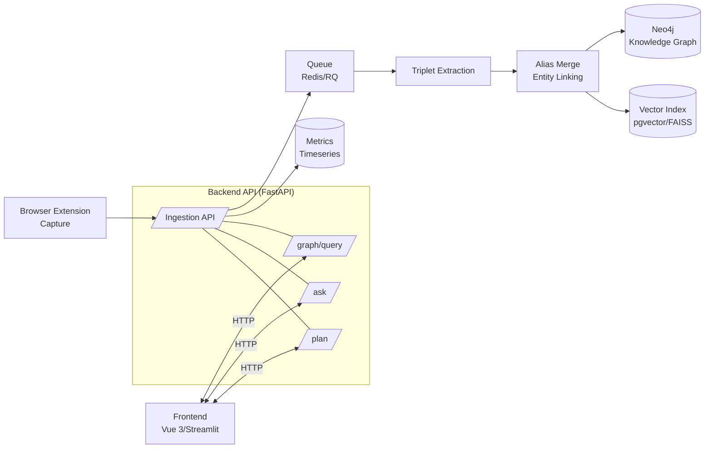
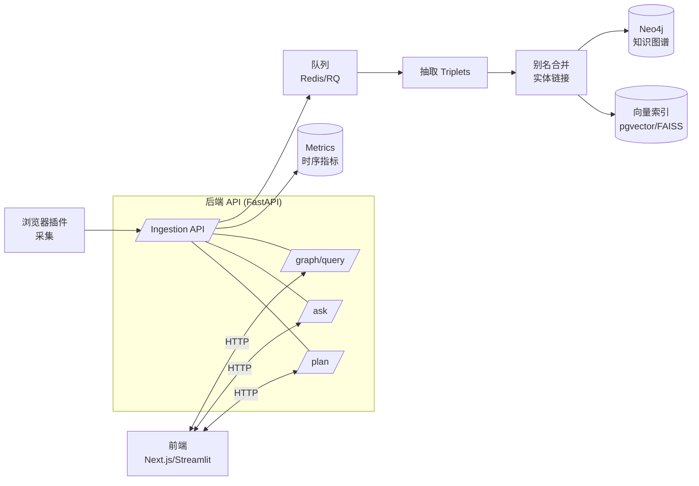

# Lunisight | 月悟

> **A quiet knowledge graph engine for insight.**  
> 在静夜中沉淀知识、联结万象、点亮顿悟。

---

## English

### 1) What is Lunisight
**Lunisight (月悟)** is a bilingual, open‑source personal knowledge graph system. It captures highlights and notes, extracts entities/relations with evidence, builds a Neo4j graph, and enables graph+vector QA and learning‑path planning.

- **Capture** with a minimalist browser extension (planned MVP).
- **Extract** triplets, link entities, deduplicate with alias‑merge.
- **Ask** questions that are answered from the graph and vectors with clickable evidence.
- **Plan** next‑week reading with explainable scoring.
- **Trace** every claim back to sources and offsets.

### 2) Key Features
- **Evidence‑bound graph**: each triple carries `evidence` + `source_id` + `offset`.
- **AI-Powered Analysis**: intelligent document segmentation with deep semantic understanding, rich concept extraction, and knowledge insights generation.
- **Clean separation**: Extension = capture; Backend = extraction/linking; Frontend = visualization & QA via API.
- **Two tracks**: Streamlit MVP → Vue 3 + Element Plus + Cytoscape.js product UI.
- **Privacy by default**: minimal capture, local‑first, JWT + RBAC, export read‑only subgraphs.

### 3) Architecture


### 4) Modules
- **Graph (悟图)**: interactive semantic graph with filters and path view
- **Ask (悟问)**: graph + vector QA, answers with citation snippets
- **Path (悟行)**: next‑week reading plan with explanations
- **Insight (悟镜)**: dashboard for intake, dedupe, precision@K
- **Echo (悟听)**: capture extension (MV3, IndexedDB queue)

### 5) Tech Stack
- **Frontend**: Vue 3, Vite, Naive UI, Cytoscape.js, ECharts (MVP alt: Streamlit)
- **Backend**: FastAPI, RQ/Celery, pydantic
- **Graph**: Neo4j 5.x (Bolt)
- **Vector**: pgvector or FAISS
- **Queue/Cache**: Redis
- **AI**: Multi-provider support (OpenAI, Anthropic, Google, DeepSeek, Qwen, GLM, Kimi, Ernie, MiniMax, Doubao, Ollama)
- **Observability**: OpenTelemetry, Prometheus

### 6) Quickstart (Docker, Dev)
```yaml
version: "3.9"
services:
  neo4j:
    image: neo4j:5
    environment:
      - NEO4J_AUTH=neo4j/test
    ports: ["7474:7474","7687:7687"]
    volumes: ["./data:/data"]
  api:
    build: ./server
    environment:
      - NEO4J_URI=bolt://neo4j:7687
      - NEO4J_USER=neo4j
      - NEO4J_PASS=test
      - AI_PROVIDER=openai  # or anthropic, deepseek, qwen, ollama, etc.
      - AI_API_KEY=your-api-key
      - VECTOR_BACKEND=pgvector
      - JWT_SECRET=devsecret
    depends_on: [neo4j]
    ports: ["8000:8000"]
  app:
    build: ./app/web
    depends_on: [api]
    ports: ["3000:3000"]
```

**AI Configuration**: See [AI Providers Guide](docs/AI_PROVIDERS.md) for detailed setup instructions for all 12 supported AI providers.

### 7) API Glance
- `POST /ingest` batch capture (id/hash‑idempotent)
- `POST /extract` run extraction; returns stats
- `GET  /graph/query?cypher=...` whitelisted Cypher or templates
- `POST /ask { q, k }` graph+vector QA with evidence and paths
- `GET  /summary/today` increments & conflicts
- `GET  /plan/next-week?limit=10` explainable recommendations

### 8) Data Model
**Nodes**: `Concept`, `Source`, `Note` (+ optional `Person/Paper/Skill/Project`)  
**Edges**: `MENTIONS`, `DERIVES_FROM`, `INTRODUCED_BY`, `SIMILAR_TO` (+ optional `SUPPORTS/CONTRADICTS`, `REQUIRES`)  

Indexes:
```cypher
CREATE CONSTRAINT concept_name_unique IF NOT EXISTS
FOR (c:Concept) REQUIRE c.name IS UNIQUE;
CREATE INDEX source_hash IF NOT EXISTS FOR (s:Source) ON (s.hash);
CREATE INDEX concept_domain IF NOT EXISTS FOR (c:Concept) ON (c.domain);
```

### 9) Security & Privacy
Minimal capture (no forms/cookies), local‑first, TLS, encrypted backups, JWT + RBAC, audit logs, data‑retention and deletion.

### 10) Roadmap (4 weeks)
1) `/ingest` + extension queue + Neo4j write + Graph MVP  
2) JSONL extraction, alias‑merge, preset queries, Ask v1  
3) Plan + evaluation panel + conflict adjudication + Sources health  
4) Vue 3 polish, RAG tuning, read‑only subgraph export, CI/CD

---

## 简体中文

### 1）项目简介
**Lunisight（月悟）** 是一套开源的个人知识图谱系统：采集网页片段与笔记，抽取实体关系，构建 Neo4j 图谱，并以图谱+向量检索提供问答与学习路径规划。

- **采集**：极简浏览器插件（MVP 规划）。  
- **抽取**：三元组、实体链接、别名合并与去重。  
- **提问**：答案来自图谱和向量，并附带可点击证据。  
- **规划**：面向下周的阅读推荐，具备可解释评分。  
- **追溯**：每条结论都可回跳到来源与文本偏移。  

### 2）核心特性
- **证据绑定**：三元组携带 `evidence + source_id + offset`。
- **AI 智能分析**：智能文档分词，深度语义理解，丰富概念抽取，知识洞察生成。支持用户自定义 Prompt 和自动优化。
- **职责清晰**：插件只采集；后端抽取/入图/检索；前端仅通过 API 呈现。  
- **双轨实现**：Streamlit MVP → Next.js + Cytoscape.js 产品化。  
- **隐私优先**：最小采集、本地优先、JWT + RBAC、只读子图导出。  

### 3）系统架构


### 4）模块划分
- **月悟·图（Graph）**：可视化图谱与最短路径、过滤与导出  
- **月悟·问（Ask）**：图谱+向量问答，答案附证据片段  
- **月悟·行（Path）**：下周阅读路径推荐与解释  
- **月悟·镜（Insight）**：仪表板与评测（新增量、去重率、精准@K）  
- **月悟·听（Echo）**：采集扩展（MV3，IndexedDB 队列）  

### 5）技术栈
前端 Vue 3 + Vite + Naive UI + Cytoscape.js + ECharts；后端 FastAPI + RQ/Celery；图 Neo4j；向量 pgvector/FAISS；队列 Redis；AI 多提供商支持（OpenAI、Anthropic、Google、DeepSeek、通义千问、智谱、Kimi、文心、MiniMax、豆包、Ollama）；可观测性 OpenTelemetry/Prometheus。

### 6）快速开始（Docker，开发）
> 同上方 English 的 `docker-compose` 示例。

**AI 配置**：查看 [AI 提供商配置指南](docs/AI_PROVIDERS.md) 了解所有 12 个支持的 AI 提供商的详细配置说明。

### 7）API 速览
- `POST /ingest` 批量采集（id/hash 幂等）  
- `POST /extract` 触发抽取并返回统计  
- `GET /graph/query?cypher=...` 白名单 Cypher 或模板  
- `POST /ask { q, k }` 图谱+向量问答，返回证据与路径  
- `GET /summary/today` 今日增量与冲突  
- `GET /plan/next-week?limit=10` 推荐与解释

### 8）数据模型
**节点**：`Concept`、`Source`、`Note`（可扩展 `Person/Paper/Skill/Project`）  
**关系**：`MENTIONS`、`DERIVES_FROM`、`INTRODUCED_BY`、`SIMILAR_TO`（可增 `SUPPORTS/CONTRADICTS`、`REQUIRES`）  
**索引**：见上方 English 中的 Cypher 片段。

### 9）安全与隐私
最小采集、不存表单与 Cookie、本地优先、传输加密、JWT + RBAC、审计日志、保留期与删除策略。

### 10）四周路线图
1）打通 `/ingest`、扩展上报、Neo4j 入库、Graph MVP  
2）三元组抽取、别名合并、预设查询、Ask v1  
3）Plan + 评测面板 + 冲突裁决 + Sources 健康页  
4）Vue 3 产品化、RAG 优化、只读子图导出、CI/CD

---

## License
Apache‑2.0 (suggested). See `LICENSE` when added.

## New: AI Intelligent Segmentation

🎉 **LunarInsight now supports AI-powered intelligent document analysis!**

Instead of just converting text to JSON triplets, the AI mode:
- 🧠 **Deep semantic understanding** - AI truly understands document content
- 💎 **Rich concept extraction** - Extracts descriptions, categories, domains, importance levels
- 🔗 **Semantic relationships** - Identifies causal, containment, comparison relationships
- 💡 **Knowledge insights** - Generates deep understanding and insights
- 🎯 **Custom prompts** - Users can specify analysis focus
- ⚡ **Auto prompt optimization** - AI automatically optimizes user prompts

### Quick Start

```bash
# Set API key
export OPENAI_API_KEY="sk-..."

# Upload with AI analysis
curl -X POST "http://localhost:8000/uploads/text" \
  -H "Content-Type: application/json" \
  -d '{
    "content": "Your document content...",
    "enable_ai_segmentation": true,
    "user_prompt": "Focus on technical architecture and design patterns"
  }'
```

### Documentation

- 📖 [Complete API Guide](docs/AI_SEGMENTATION_API.md)
- 🚀 [Quick Start Guide](README_AI_SEGMENTATION.md)
- 💻 [Example Code](examples/ai_segmentation_example.py)
- 📝 [Implementation Summary](IMPLEMENTATION_SUMMARY.md)

---

## Contributing
Issues and PRs are welcome. Please open discussions for API/Schema changes first.
