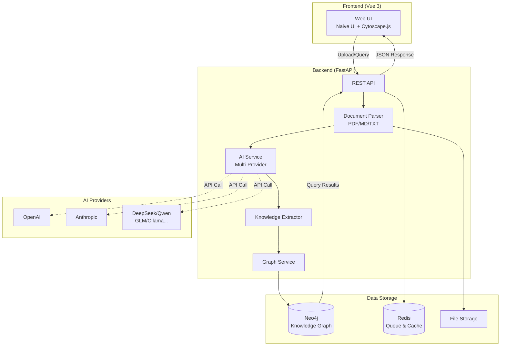

# LunarInsight | 月悟

> **A quiet knowledge graph engine for insight.**  
> 在静夜中沉淀知识、联结万象、点亮顿悟。

[](LICENSE)
[](https://www.python.org)
[](https://vuejs.org)
[](https://neo4j.com)

**Language**: [English](README_EN.md) | [简体中文](README.md)

---

## 🖼️ Screenshots

<details>
<summary>Click to view screenshots</summary>

### Dashboard
> Overview of your knowledge graph with statistics and recent activities
<!--  -->

### Knowledge Graph Visualization
> Interactive graph exploration with Cytoscape.js
<!--  -->

### Knowledge Cards Management
> Create and manage knowledge cards with rich metadata
<!--  -->

### Document Upload & Processing
> Upload documents and let AI extract knowledge automatically
<!--  -->

</details>

---

## 📖 Table of Contents

- [What is LunarInsight](#1-what-is-lunarinsight)
- [Key Features](#2-key-features)
- [Architecture](#3-architecture)
- [Core Modules](#4-core-modules)
- [Tech Stack](#5-tech-stack)
- [Quick Start](#6-quick-start)
- [API Overview](#7-api-overview)
- [Data Model](#8-data-model)
- [Usage Examples](#9-usage-examples)
- [Roadmap](#10-roadmap)
- [Documentation](#-documentation)
- [Contributing](#-contributing)
- [Troubleshooting](#-troubleshooting)
- [License](#-license)

---

## 1) What is LunarInsight

**LunarInsight (月悟)** is an AI-driven, open-source personal knowledge graph system that transforms your documents into an interconnected knowledge network. It intelligently extracts entities and relationships, builds a Neo4j graph, and enables powerful knowledge exploration and analysis.

- **🤖 AI-Powered**: Multi-provider AI support (OpenAI, Anthropic, DeepSeek, Qwen, Ollama, and 7+ more)
- **📚 Document Processing**: Upload PDFs, Markdown, or text files for automatic knowledge extraction
- **🕸️ Knowledge Graph**: Build and visualize semantic relationships between concepts
- **💡 Smart Cards**: Create and manage knowledge cards manually or through AI extraction
- **🔍 Query & Explore**: Interactive graph visualization with Cytoscape.js
- **🌐 Bilingual**: Full Chinese and English interface support

## 2) Key Features

- **🎯 AI-Powered Intelligent Analysis**
  - Deep semantic understanding with customizable prompts
  - Rich concept extraction with categories, domains, and importance levels
  - Semantic relationship identification (causal, containment, comparison)
  - Knowledge insights and understanding generation
  - Auto prompt optimization for better results

- **🗂️ Flexible Knowledge Management**
  - Create knowledge cards manually or via AI extraction
  - Tag system with aliases and related concepts
  - Domain and category organization
  - Importance levels (low, medium, high)
  - Full CRUD operations via REST API

- **🔌 Multi-Provider AI Support**
  - 12 AI providers: OpenAI, Anthropic, Google Gemini, DeepSeek, Qwen, GLM, Kimi, Ernie, MiniMax, Doubao, Ollama, Mock
  - Unified configuration interface
  - Easy provider switching
  - Local model support via Ollama

- **🎨 Modern UI**
  - Vue 3 + Vite + Naive UI
  - Interactive graph visualization with Cytoscape.js
  - Real-time processing status
  - Responsive design
  - Dark mode support (coming soon)

- **🔐 Privacy & Security**
  - Local-first architecture
  - Self-hosted deployment
  - No data leaves your infrastructure
  - Optional authentication (JWT + RBAC planned)

## 3) Architecture



## 4) Core Modules

**Frontend (Vue 3)**
- **🏠 Dashboard**: Overview of knowledge graph statistics and recent activities
- **📤 Knowledge Build**: Document upload and AI-powered processing
- **🃏 Knowledge Cards**: Manual knowledge card creation and management
- **🕸️ Graph Visualization**: Interactive graph exploration with Cytoscape.js
- **🔍 Query**: Cypher query interface for advanced graph queries
- **⚙️ Settings**: System configuration and AI provider settings
- **📊 Status**: Real-time processing status and system health

**Backend (FastAPI)**
- **Document Processing**: Multi-format parser (PDF, Markdown, TXT)
- **AI Integration**: Unified interface for 12+ AI providers
- **Knowledge Extraction**: Intelligent concept and relationship extraction
- **Graph Management**: Neo4j CRUD operations and query execution
- **Queue Management**: Async processing with Redis
- **API Routes**: RESTful endpoints for all operations

## 5) Tech Stack

| Layer | Technologies |
|-------|-------------|
| **Frontend** | Vue 3, TypeScript, Vite, Naive UI, Cytoscape.js, Axios, Vue-i18n, Pinia |
| **Backend** | Python 3.11+, FastAPI, Pydantic v2, Uvicorn |
| **Database** | Neo4j 5.x (Bolt), Redis 7.x |
| **AI/ML** | OpenAI, Anthropic, Google Gemini, DeepSeek, Alibaba Qwen, Zhipu GLM, Moonshot Kimi, Baidu Ernie, MiniMax, Bytedance Doubao, Ollama |
| **Document Processing** | PyMuPDF (PDF), Markdown, Plain Text |
| **Container** | Docker, Docker Compose |
| **Future** | Vector search (pgvector/FAISS), OpenTelemetry, Prometheus |

## 6) Quick Start

**Prerequisites**
- Docker & Docker Compose (recommended)
- OR Python 3.11+, Node.js 18+, Neo4j 5.x, Redis 7.x (for local development)

**Option A: Docker Compose (Recommended)**

```bash
# 1. Clone the repository
git clone https://github.com/yourusername/LunarInsight.git
cd LunarInsight

# 2. Configure environment variables
cat > .env << EOF
# AI Provider Configuration (choose one)
AI_PROVIDER=openai
AI_API_KEY=sk-your-api-key-here

# Or use Ollama for local models
# AI_PROVIDER=ollama
# AI_BASE_URL=http://host.docker.internal:11434

# Neo4j Configuration
NEO4J_URI=bolt://neo4j:7687
NEO4J_USER=neo4j
NEO4J_PASS=test1234

# Redis Configuration
REDIS_URL=redis://redis:6379/0
EOF

# 3. Start all services
docker-compose up -d

# 4. Access the application
# - Frontend: http://localhost:8788
# - API Docs: http://localhost:8000/docs
# - Neo4j Browser: http://localhost:7474 (neo4j/test1234)
```

**Option B: Local Development**

```bash
# 1. Start Neo4j and Redis with Docker
docker-compose up -d neo4j redis

# 2. Set up backend
cd server
python -m venv venv
source venv/bin/activate  # Windows: venv\Scripts\activate
pip install -r requirements.txt

# Configure environment
export NEO4J_URI=bolt://localhost:7687
export NEO4J_USER=neo4j
export NEO4J_PASS=test1234
export AI_PROVIDER=openai
export AI_API_KEY=sk-your-key

# Start backend
uvicorn main:app --reload --port 8000

# 3. Set up frontend (in another terminal)
cd app/vue
npm install
npm run dev  # Starts on http://localhost:5173
```

**📖 Detailed Guides**
- [AI Providers Configuration](docs/AI_PROVIDERS.md) - Setup for all 12 AI providers
- [Quick Start Guide](QUICKSTART.md) - Comprehensive setup instructions
- [Environment Variables](docs/env-template.md) - Complete configuration reference

## 7) API Overview

**Document & Knowledge Management**
```
POST   /uploads/file               # Upload file (PDF/MD/TXT)
POST   /uploads/text               # Upload text content
GET    /uploads/{file_id}          # Get file info
POST   /ingest/{document_id}       # Start AI extraction
GET    /ingest/status/{job_id}     # Check processing status
```

**Knowledge Cards**
```
POST   /knowledge-cards            # Create knowledge card
GET    /knowledge-cards            # List cards (with filters)
GET    /knowledge-cards/{card_id}  # Get card details
PUT    /knowledge-cards/{card_id}  # Update card
DELETE /knowledge-cards/{card_id}  # Delete card
```

**Graph Operations**
```
GET    /graph/query                # Execute Cypher query
GET    /graph/nodes                # Get all nodes
GET    /graph/edges                # Get all relationships
GET    /graph/stats                # Get graph statistics
```

**System**
```
GET    /settings/ai-providers      # List available AI providers
GET    /settings/config            # Get system configuration
PUT    /settings/config            # Update configuration
GET    /                           # API health check
GET    /docs                       # OpenAPI documentation
```

📚 **Full API Documentation**: Available at `http://localhost:8000/docs` when running

## 8) Data Model

**Node Types**
- **`Concept`**: Core knowledge entities
  - Properties: `name`, `description`, `domain`, `category`, `importance`, `tags`, `created_at`, `updated_at`, `source`
- **`Document`**: Uploaded documents
  - Properties: `id`, `filename`, `checksum`, `kind`, `size`, `created_at`, `status`
- **`Alias`**: Alternative names for concepts
  - Properties: `name`

**Relationship Types**
- **`MENTIONS`**: Document mentions a concept
  - Properties: `evidence`, `offset`, `confidence`
- **`DERIVES_FROM`**: Concept derives from another concept
  - Properties: `relationship_type`, `description`
- **`RELATED_TO`**: Concepts are related
  - Properties: `strength`, `context`
- **`REFERS_TO`**: Alias refers to a concept
  - No properties

**Neo4j Constraints & Indexes**
```cypher
# Constraints
CREATE CONSTRAINT concept_name_unique IF NOT EXISTS
  FOR (c:Concept) REQUIRE c.name IS UNIQUE;

CREATE CONSTRAINT document_id_unique IF NOT EXISTS
  FOR (d:Document) REQUIRE d.id IS UNIQUE;

# Indexes
CREATE INDEX document_checksum IF NOT EXISTS
  FOR (d:Document) ON (d.checksum);

CREATE INDEX concept_domain IF NOT EXISTS
  FOR (c:Concept) ON (c.domain);

CREATE INDEX concept_category IF NOT EXISTS
  FOR (c:Concept) ON (c.category);
```

## 9) Usage Examples

**1. Upload and Process a Document**
```bash
# Upload a file
curl -X POST "http://localhost:8000/uploads/file" \
  -F "file=@document.pdf"

# Start AI extraction with custom prompt
curl -X POST "http://localhost:8000/ingest/{document_id}" \
  -H "Content-Type: application/json" \
  -d '{
    "enable_ai_segmentation": true,
    "user_prompt": "Focus on technical concepts and methodologies"
  }'

# Check processing status
curl "http://localhost:8000/ingest/status/{job_id}"
```

**2. Create a Knowledge Card**
```bash
curl -X POST "http://localhost:8000/knowledge-cards" \
  -H "Content-Type: application/json" \
  -d '{
    "name": "Machine Learning",
    "description": "A subset of AI focused on learning from data",
    "domain": "Computer Science",
    "category": "Technology",
    "importance": "high",
    "tags": ["AI", "data science"],
    "aliases": ["ML"],
    "related_concepts": ["Deep Learning", "Neural Networks"]
  }'
```

**3. Query the Knowledge Graph**
```bash
# Get all concepts in a domain
curl "http://localhost:8000/graph/query?cypher=MATCH%20(c:Concept)%20WHERE%20c.domain='Technology'%20RETURN%20c"

# Get graph statistics
curl "http://localhost:8000/graph/stats"
```

## 10) Roadmap

**Current Version (v0.9)**
- ✅ Multi-provider AI integration (12 providers)
- ✅ Document upload and processing (PDF, Markdown, TXT)
- ✅ AI-powered knowledge extraction
- ✅ Manual knowledge card management
- ✅ Interactive graph visualization
- ✅ Bilingual UI (Chinese/English)
- ✅ Docker deployment

**Next Version (v1.0) - Q2 2025**
- 🎯 Vector search integration (pgvector/FAISS)
- 🎯 Advanced query builder UI
- 🎯 Knowledge card templates
- 🎯 Batch import/export
- 🎯 Graph analytics dashboard
- 🎯 Browser extension for web capture

**Future (v1.1+)**
- 🔮 Natural language Q&A over knowledge graph
- 🔮 Learning path planning and recommendations
- 🔮 Conflict detection and resolution
- 🔮 Multi-user support with JWT authentication
- 🔮 Notion/Obsidian connectors
- 🔮 Mobile app (React Native)
- 🔮 OpenTelemetry observability

---

## 📚 Documentation

- **[Quick Start Guide](QUICKSTART.md)** - Step-by-step setup instructions
- **[AI Providers Guide](docs/AI_PROVIDERS.md)** - Configuration for all 12 AI providers
- **[AI Segmentation API](docs/AI_SEGMENTATION_API.md)** - AI-powered document analysis
- **[Environment Variables](docs/env-template.md)** - Complete configuration reference
- **[Frontend Integration](docs/FRONTEND_AI_INTEGRATION.md)** - Frontend AI features
- **[Implementation Summary](docs/IMPLEMENTATION_SUMMARY.md)** - Technical implementation details

## 🤝 Contributing

We welcome contributions! Here's how you can help:

1. **Report Bugs**: Open an issue describing the bug and how to reproduce it
2. **Suggest Features**: Open an issue with the `enhancement` label
3. **Submit PRs**: 
   - Fork the repository
   - Create a feature branch (`git checkout -b feature/amazing-feature`)
   - Commit your changes (`git commit -m 'Add amazing feature'`)
   - Push to the branch (`git push origin feature/amazing-feature`)
   - Open a Pull Request

**Guidelines**:
- Follow existing code style and conventions
- Add tests for new features
- Update documentation as needed
- For major changes, please open an issue first to discuss

## 🐛 Troubleshooting

**Neo4j Connection Error**
```bash
# Check if Neo4j is running
docker ps | grep neo4j

# Check connection
curl http://localhost:7474
```

**AI Provider Error**
```bash
# Verify API key is set
echo $AI_API_KEY

# Check logs
docker-compose logs api
```

**Frontend Build Error**
```bash
# Clear node_modules and reinstall
cd app/vue
rm -rf node_modules package-lock.json
npm install
```

**Port Already in Use**
```bash
# Find process using port 8000
lsof -ti:8000

# Kill the process
kill -9 $(lsof -ti:8000)
```

## 📄 License

Apache License 2.0 - See [LICENSE](LICENSE) file for details.

## 🙏 Acknowledgments

- **Neo4j** - Graph database platform
- **FastAPI** - Modern Python web framework
- **Vue.js** - Progressive JavaScript framework
- **Naive UI** - Vue 3 component library
- **Cytoscape.js** - Graph visualization library
- All the amazing open-source AI providers

## 📮 Contact & Support

- **Issues**: [GitHub Issues](https://github.com/yourusername/LunarInsight/issues)
- **Discussions**: [GitHub Discussions](https://github.com/yourusername/LunarInsight/discussions)
- **Email**: your-email@example.com (if applicable)

---

<p align="center">Made with ❤️ by the LunarInsight community</p>
<p align="center">⭐ Star us on GitHub if you find this project helpful!</p>

